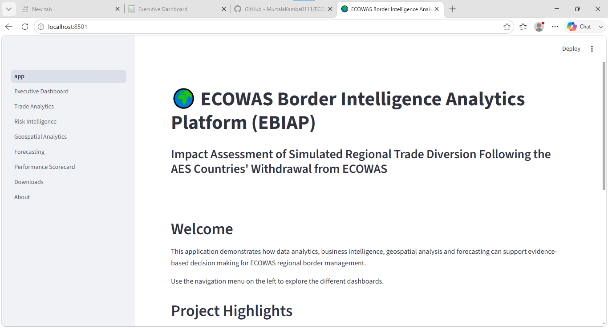

# 🌍 ECOWAS Border Intelligence Analytics Platform (EBIAP)

## Overview

The ECOWAS Border Intelligence Analytics Platform (EBIAP) is an interactive Business Intelligence dashboard developed using Python and Streamlit to support regional border management, trade monitoring, customs intelligence, and decision-making across ECOWAS member states.

The project demonstrates the application of Data Analytics, Business Intelligence, Geospatial Analytics, and Predictive Analytics for monitoring cross-border trade activities.

---

## Features

- 📊 Executive Dashboard
- 📈 Trade Analytics
- 🚨 Risk Intelligence
- 🌍 Geospatial Analytics
- 📉 Forecast Analytics
- 🏆 Performance Scorecard
- 📥 Download Centre
- ℹ️ About Page

---
## Dashboard Preview

### Executive Dashboard

 
## Technologies Used

- Python
- Streamlit
- Pandas
- NumPy
- Plotly
- Folium
- Streamlit-Folium
- Scikit-learn
- OpenPyXL

---

## Project Structure

```
ECOWAS-Border-Intelligence-Analytics/

│── app.py
│── requirements.txt
│── README.md
│── .gitignore

├── data/
├── outputs/
├── pages/
```

---

## Installation

Clone the repository:

```bash
git clone https://github.com/yourusername/ECOWAS-Border-Intelligence-Analytics.git
```

Install dependencies:

```bash
pip install -r requirements.txt
```

Run the application:

```bash
streamlit run app.py
```

---

## Future Improvements

- Machine Learning Forecasting
- Interactive Trade Flow Maps
- AI-powered Risk Prediction
- ECOWAS Live Border Monitoring
- Real-time API Integration

---

## Author

**Dr. Ahmed Murtala Kamba**

- PhD Physics (Spectroscopy)
- MSc Physics (Nuclear & Radiation)
- Planning, Research & Statistics
- Border Security"
- Data Analytics | Business Intelligence | Artificial Intelligence | Project Management

## License

This project is intended for academic, research, and portfolio purposes.
